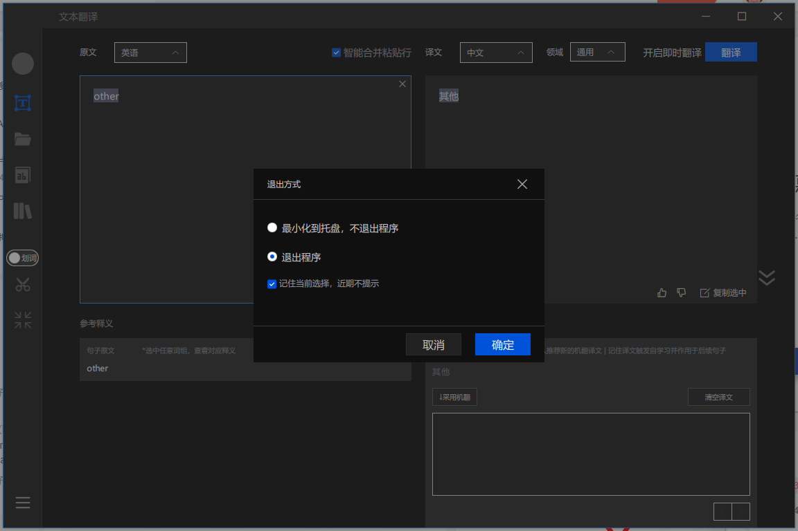

# config 软件设置

`对于已经安装完成的软件,可以对设置进行优化,以达到加速电脑运行的目的`

## 开机启动项

`通过软件设置取消开机启动,根据个人需求,减少不必要的开机启动
开机启动项太多,会导致计算机启动时间加长`

 

## 更改数据/文件存储目录

- 减少系统盘数据处理压力 以及容量限制.
- 当系统崩溃等原因需要重装系统时,重装系统后,可快速恢复数据.

 

## 软件关闭时处理
`软件关闭时,按需设置缩小或退出`

- 常用小软件可设置为缩小到托盘(如:翻译软件,聊天软件等)
- 占用内存较多,且不频繁使用的软件,选择退出程序 近期不提示.(如: 爱奇艺播放器之类)

 

`任务栏下方对已经启用软件进行管理`
 

