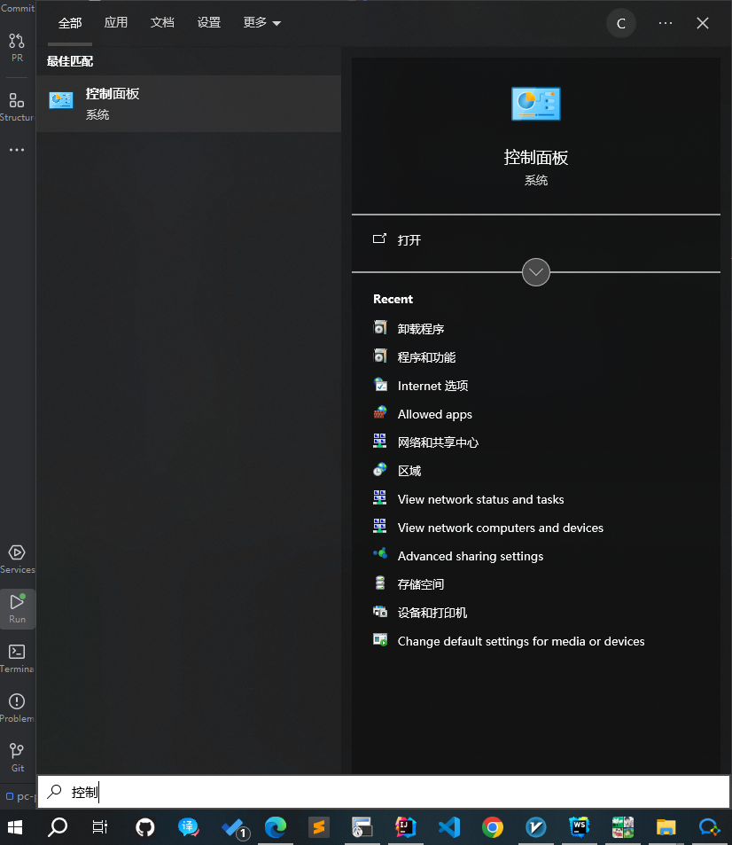

# setup 软件安装

## 安装路径
`软件安装时,建议通过自定义路径安装到非C盘`

 

## 安装过程
`软件过程中,注意不要一味点下一步,需要取消关联安装软件 以及按需设置开机启动.`

 

## 软件卸载
`对于不需要的软件 或有其它替代软件时,及时进行卸载清理`

- 打开"控制面板"
  1. Win+R 输入Control 回车
  2. 按Win 输入 控制面板
  3. 按Win 直接在左侧找
- 卸载软件
    `注意卸载选项!`

 