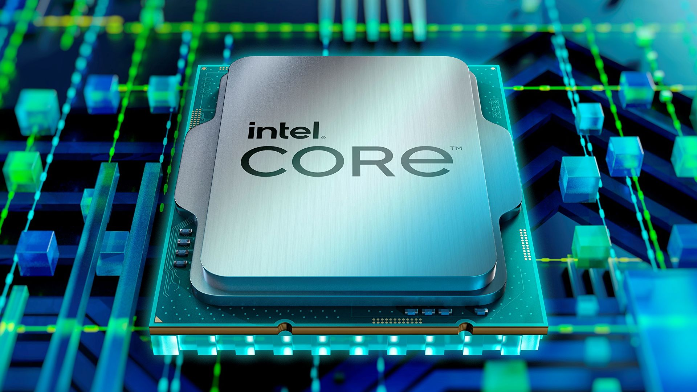
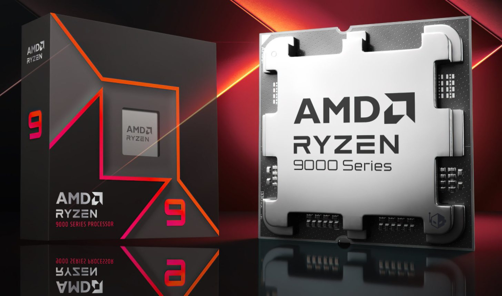
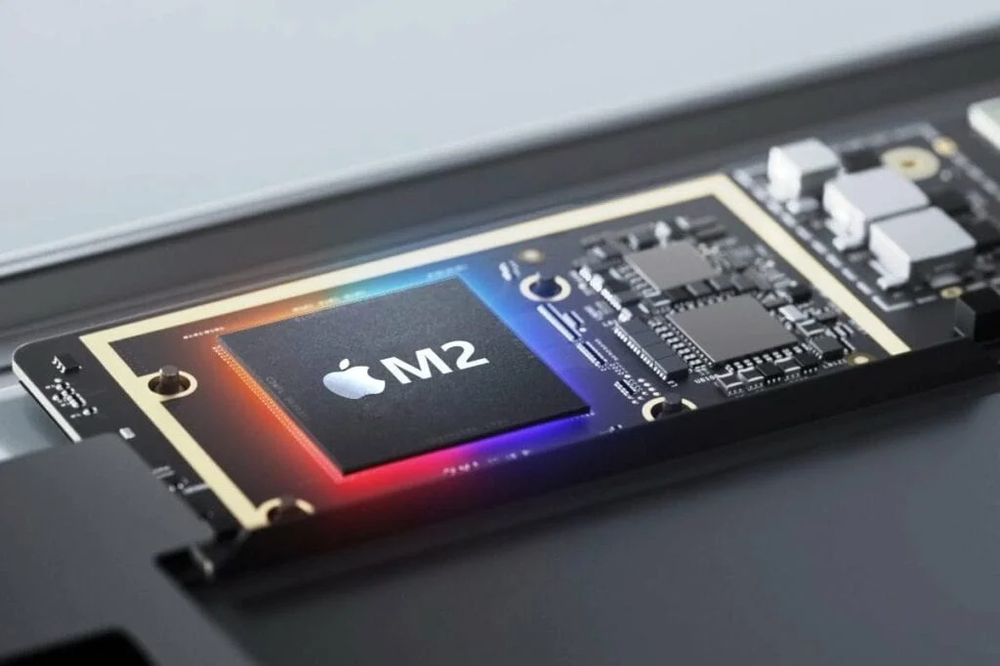
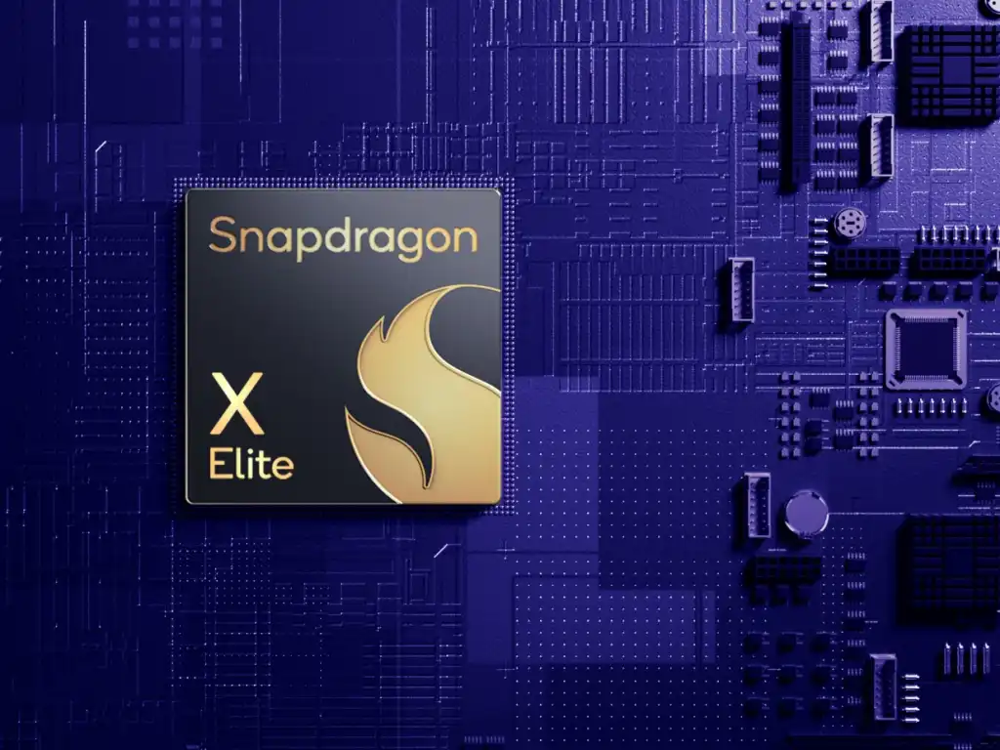

# CPU 中央处理器

`CPU是电脑的`“大脑”`，负责解释和执行来自计算机程序的指令。它包含算术逻辑单元（ALU）和控制单元（CU），进行数据运算和逻辑判断，以及控制数据的流动和处理。`


## 厂商
:::tip{title=" "}
市场占有率 稳定性 前期为什么基本上是intel CPU , 苹果CPU 前身 intel X86, Qualcomm 最大手机处理器供应商
:::

| 厂商                     | 英特尔                            | AMD                          | 苹果                      | 高通                            |
|------------------------|--------------------------------|------------------------------|-------------------------|-------------------------------|
| Images                 |      |      |  |  |
| Processor Technology   | Intel 7nm                      | TSMC 4nm                     | TSMC 3nm                | TSMC 4nm                      |
| CPU Architecture       | X86                            | X86                          | X86>Arm                 | Arm                           |


## 制程
:::tip{title=" "}
制程就是通常我们所说的CPU的“制作工艺”，是指在生产CPU过程中，集成电路的精细度，也就是说精度越高，生产工艺越先进。
在同样的材料中可以制造更多的电子元件，连接线也越细，精细度就越高，CPU的功耗也就越小。0.4mm为10W层4nm工艺
制程所用的单位nm
:::
``` math
1nm=1.0×10^{-9}m=1.0×10^{-6}mm
```

## 架构

| 架构   | X86         | ARM          | RISC-V       | MIPS         |
|------|-------------|--------------|--------------|--------------|
| 指令集  | 复杂指令集（CISC） | 精简指令集（RISC）  | 精简指令集（RISC）  | 精简指令集（RISC）  |
| 特点   | 高功耗、高性能,应用于服务器\PC设备     | 低功耗，广泛用于移动\服务器\PC设备 | 开源,低功耗,用于移动\穿戴\物联\服务器\PC设备, | 低功耗，广泛用于移动设备 |
| 代表厂商 | 英特尔,AMD     | 苹果,高通,华为 | 华为,阿里,腾讯,高通,英特尔,英伟达,谷哥    | 龙芯           |

