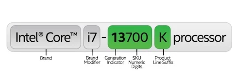
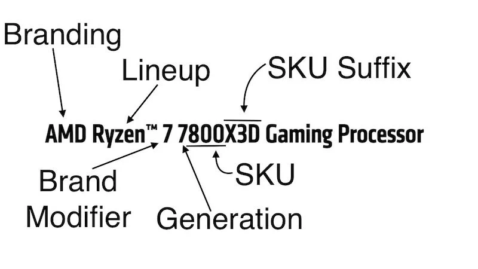

# CPU 中央处理器

`CPU是电脑的`“大脑”`，负责解释和执行来自计算机程序的指令。它包含算术逻辑单元（ALU）和控制单元（CU），进行数据运算和逻辑判断，以及控制数据的流动和处理。`


## 厂商
:::tip{title=" "}
市场占有率 稳定性 前期为什么基本上是intel CPU , 苹果CPU 前身 intel X86, Qualcomm 最大手机处理器供应商
Branding
Processor Series or Brand Modifier
Generation of the CPU
SKU/Numeric Digit
SKU Suffix
Intel Core i5-1235U: Intel Core signifies Intel’s branding, i5 signifies the brand modifier, the number 1235 signifies the SKU / Numeric Digit, and U signifies the SKU suffix.
:::

| 厂商                     | 英特尔                            | AMD                          | 苹果                      | 高通                            |
|------------------------|--------------------------------|------------------------------|-------------------------|-------------------------------|
| Images                 |      |      |  |  |
| Processor Nomenclature |  |  |                         |                               |
| Processor Technology   | Intel 7nm                      | TSMC 4nm                     | TSMC 3nm                | TSMC 4nm                      |


## 制程
:::tip{title=" "}
制程就是通常我们所说的CPU的“制作工艺”，是指在生产CPU过程中，集成电路的精细度，也就是说精度越高，生产工艺越先进。
在同样的材料中可以制造更多的电子元件，连接线也越细，精细度就越高，CPU的功耗也就越小。0.4mm为10W层4nm工艺
制程所用的单位nm
:::
``` math
1nm=1.0×10^{-9}m=1.0×10^{-6}mm
```

:::tip
这是一个 `tip` 类型的 `block`
:::

:::info
这是一个 `info` 类型的 `block`
:::

:::warning
这是一个 `warning` 类型的 `block`
:::

:::danger
这是一个 `danger` 类型的 `block`
:::

::: details
这是一个 `details` of type `block`
:::

:::tip 自定义标题
自定义标题的 `block`
:::

:::tip{title=自定义标题}
自定义标题的 `block`
:::


1纳米=0.000000001米=

## 架构

### X86架构

### ARM架构

### RISC-V架构