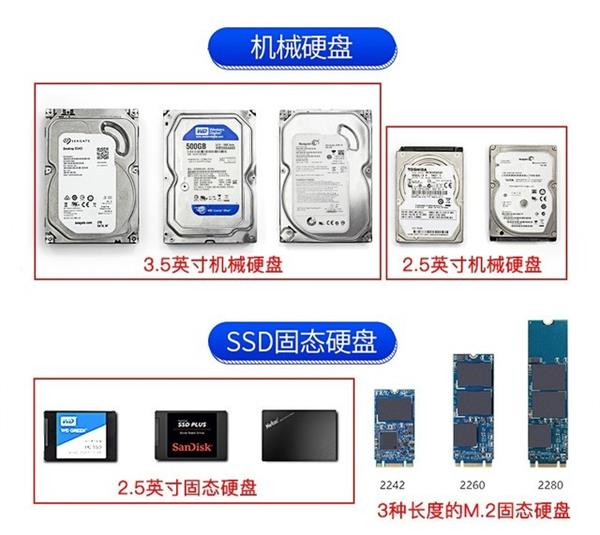
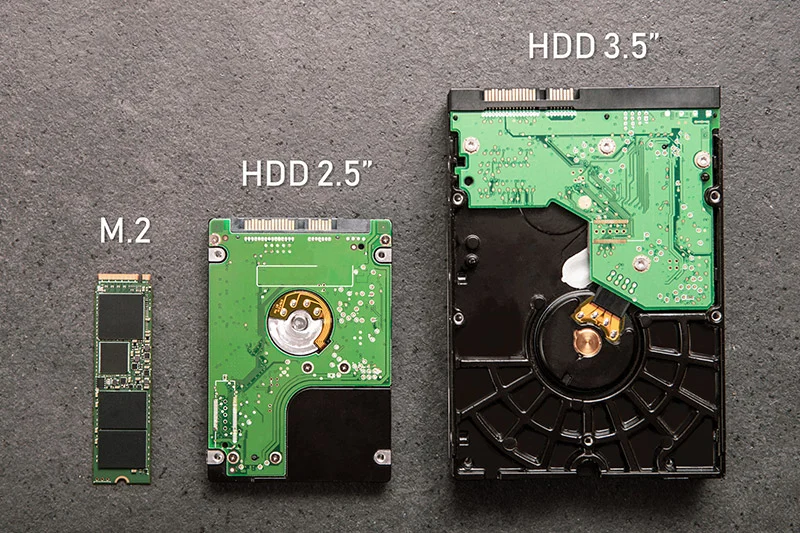
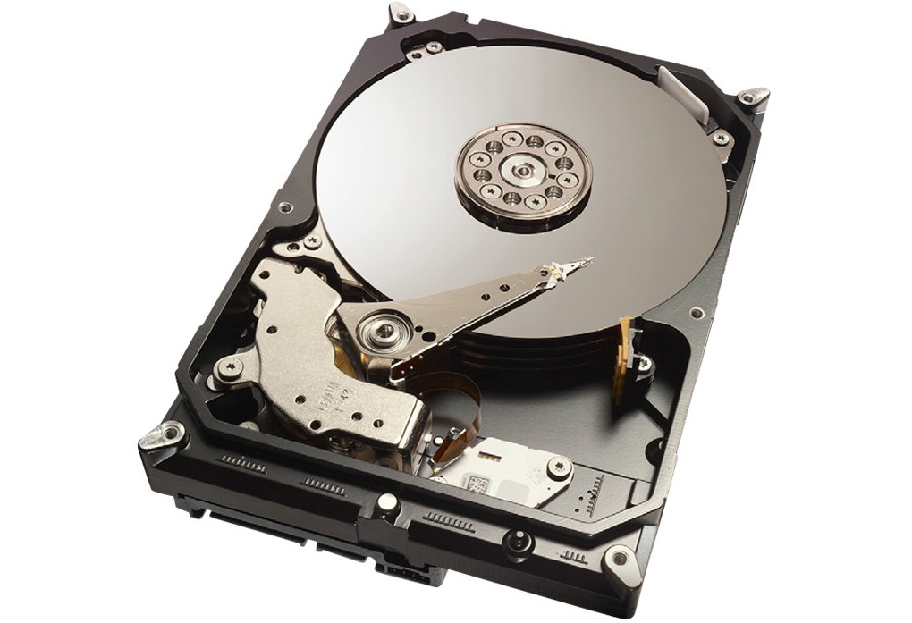
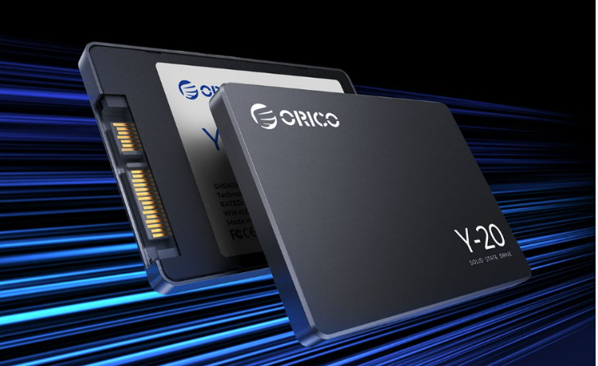
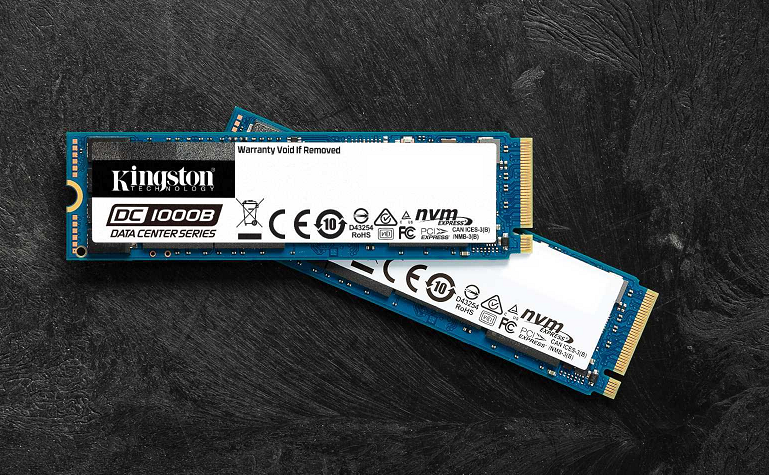

# Disk 硬盘

`硬盘是长期存储数据的地方，无论是操作系统、应用程序还是个人文件都会存储在硬盘上。固态硬盘使用闪存技术，比传统机械硬盘更快、更可靠`

## 对比

|  | 硬盘                                 |
|----|------------------------------------|
| 类型 |  | 
| 大小 |  |

| 厂商     | 机械硬盘-SATA                 | 固态硬盘-SATA                      | 固态硬盘-M2                      |
|--------|---------------------------|--------------------------------|------------------------------|
| Images |  |  |  | 
| 速度     | 50-200MB                  | 400-600MB                      | 2000-8000MB                  | 
| 特点     | 成本低,兼容好,数据损坏修复可能性大        | 成本中等,速度相对较快,数据损坏难以修复           | 速度快,成本高,对硬件要求高,数据损坏难以修复      | 
| 适用于    | 旧设备\存储服务器                 | 旧设备升级                          | 新设备                          | 
