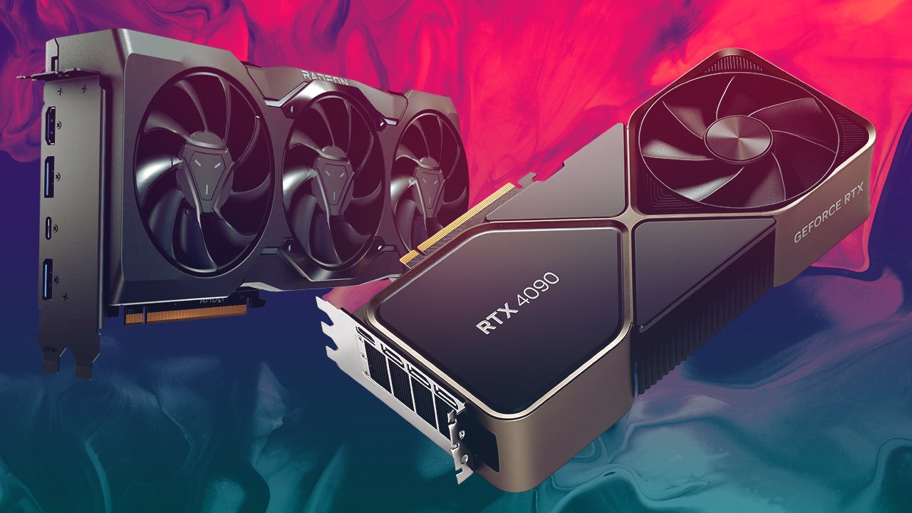
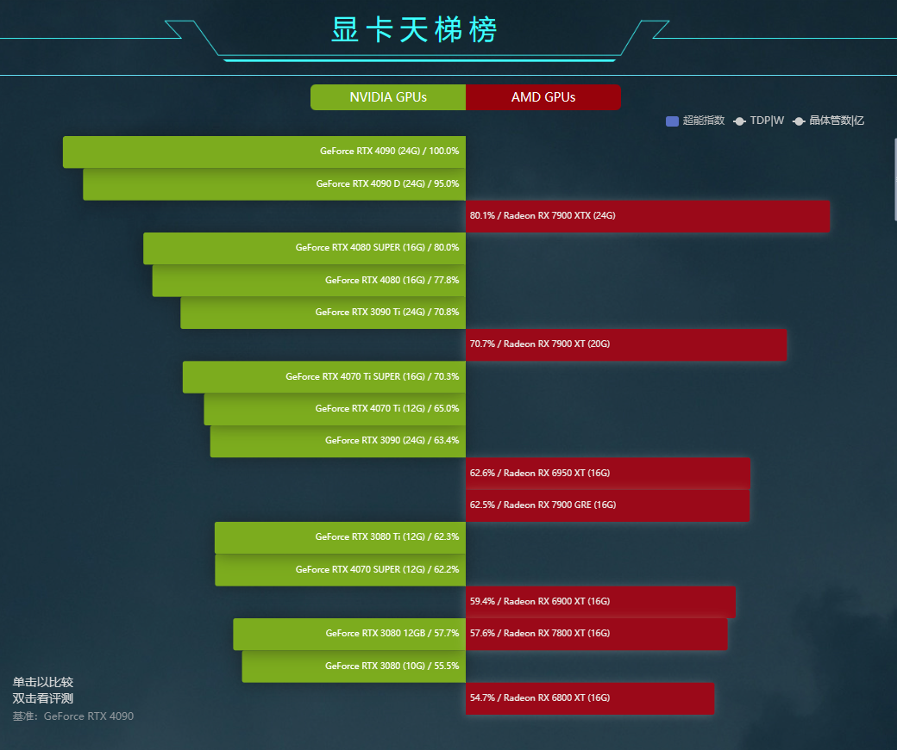
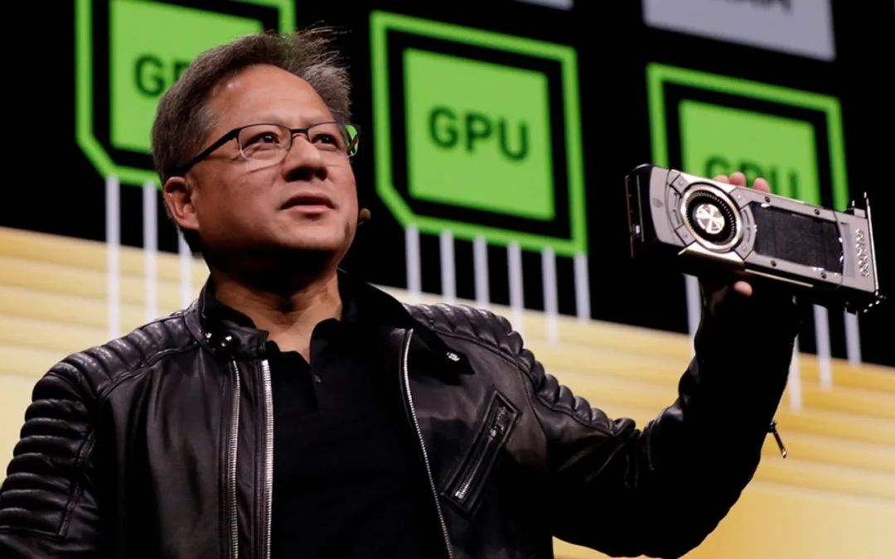
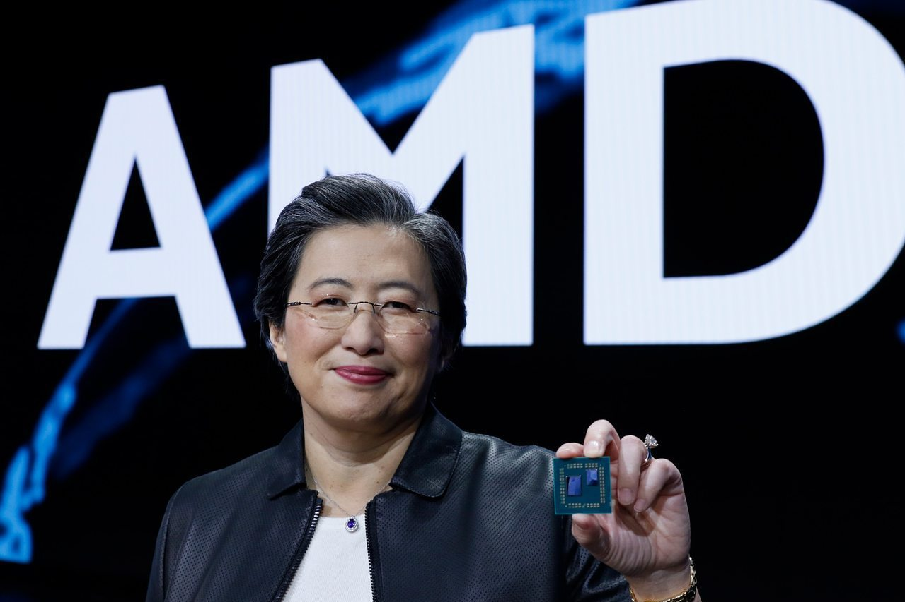

# GPU 显卡

`GPU:英文全称Graphic Processing Unit，中文翻译为“图形处理器”。
一个专门的图形核心处理器。GPU是显示卡的“大脑”，决定了该显卡的档次和大部分性能，同时也是2D显示卡和3D显示卡的区别依据。
2D显示芯片在处理3D图像和特效时主要依赖CPU的处理能力，称为“软加速”。3D显示芯片是将三维图像和特效处理功能集中在显示芯片内，也即所谓的“硬件加速”功能`

## 显卡天梯图

## 显卡对比

| 厂商     | 英伟达                        | AMD                     | 因特尔                           |
|--------|----------------------------|-------------------------|-------------------------------|
| Images |  |  |                               | 
| 近期代表产品 | RTX 30xx系列,RTX 40xx系列      | RX 6000系列,RX 7000系列     | ARC 700系列,ARC 500系列,ARC 300系列 | 
| 适用     | 成本低,兼容好,数据损坏修复可能性大         | 成本中等,速度相对较快,数据损坏难以修复    | 速度快,成本高,对硬件要求高,数据损坏难以修复       | 
| 适用于    | 旧设备\存储服务器                  | 旧设备升级                   | 新设备                           | 