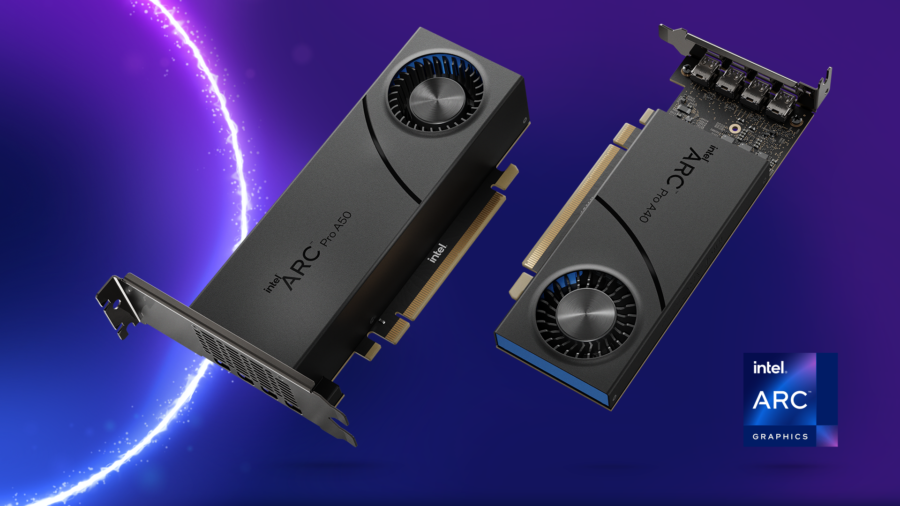

# GPU 显卡

`GPU:英文全称Graphic Processing Unit，中文翻译为“图形处理器”。
一个专门的图形核心处理器。GPU是显示卡的“大脑”，决定了该显卡的档次和大部分性能，同时也是2D显示卡和3D显示卡的区别依据。
2D显示芯片在处理3D图像和特效时主要依赖CPU的处理能力，称为“软加速”。3D显示芯片是将三维图像和特效处理功能集中在显示芯片内，也即所谓的“硬件加速”功能`

- Q:为什么办公室显卡不常见？
- A:办工所用的CPU一般集成显卡，用于对图形处理能力要求不高的场景！

## 显卡天梯榜

## 显卡对比

| 厂商     | 英伟达                        | AMD                     | 因特尔                           |
|--------|----------------------------|-------------------------|-------------------------------|
| Images |  |  |     | 
| 近期代表产品 | RTX 30xx系列,RTX 40xx系列      | RX 6000系列,RX 7000系列     | ARC 700系列,ARC 500系列,ARC 300系列 | 
| 适用     | AI训练和推理、科学计算、虚拟现实和图形渲染     | AI训练和推理、科学计算、虚拟现实和图形渲染  | 科学计算、图形渲染                     | 
| 特点     | 价格昂贵、算力强、驱动完善、生态丰富         | 生产能力稍弱、游戏性价比高、软件生态稍弱    | 新型产品、驱动优化差、软件生态弱              | 