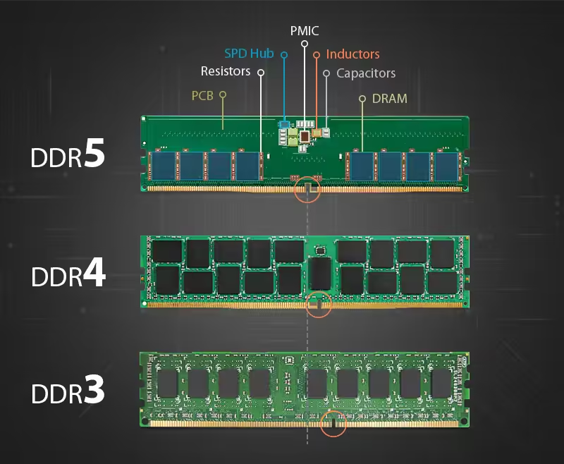
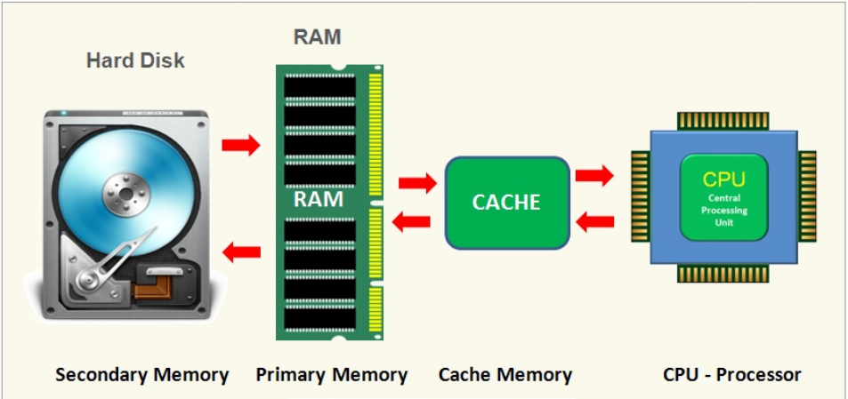

# Memory 内存

`内存是临时存储空间，当电脑运行程序或处理数据时，这些信息会加载到内存中以便CPU快速访问。内存的大小和速度直接影响电脑的响应速度
内存读写的速度为70GB/s+,是高速m2硬盘访问速度10倍以上.
`

## 接口对比

## 读取顺序

- 修车老师傅,实习生拿工具 

## 内存双通道
`内存双通道，就是在北桥（又称之为MCH）芯片级里设计两个内存控制器，这两个内存控制器可相互独立工作，
每个控制器控制一个内存通道。在这两个内存通道CPU可分别寻址、读取数据，从而使内存的带宽增加一倍，数据存取速度也相应增加一倍（理论上）。
服务器通常还支持4通道\6通道等.
`
- 实例: 管理1000份线下纸质合同文档, 1000/放一个箱,合同提取时使用1个人查找;   1000份放2个箱,查询派两个人分别查找;

## 内存选择
`内存基本上是根据CPU跟主板决定 个人使用内存,一般购买套条,  16G*2  24G*2 32G*2 (品牌 频率相同)`

|      | DDR3      | DDR4       | DDR5           |
|------|-----------|------------|----------------|
| 发布时间 | 2007年     | 2011年      | 2020年          | 
| 特点   | 停产,市场二手存量 | 保有量最大,性价比高 | 速度快,技术新,更换成本最低 | 

