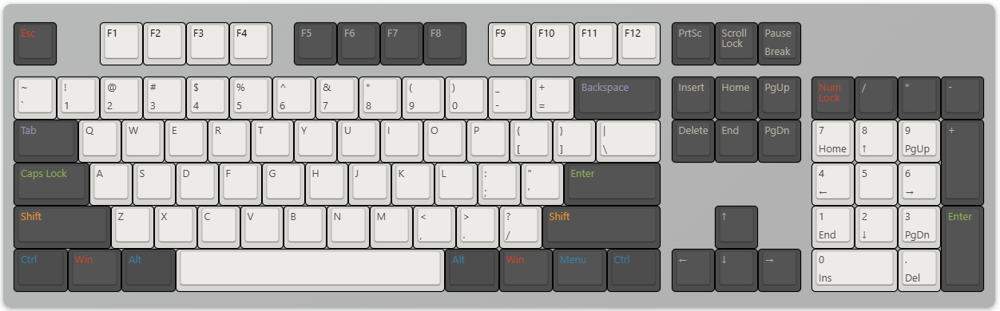

# 常用快捷键
`常用快捷键有 Ctrl Win Alt Shift Tab Esc, F1-F12 左下角组合比较多,适用于左手快捷键 右手鼠标`
`操作系统有对应的快捷键,很多软件也有自己的快捷键,熟悉掌握快捷键可以加快操作效率`

## Windows 快捷键
`通过以下桌面键盘快捷方式，可以跨桌面环境（包括“开始”菜单、任务栏、“设置”等）高效地打开、关闭、导航和执行任务。`

- **Alt + Esc** - 循环浏览打开的窗口。

- **Alt + F4** - 关闭活动窗口。 (如果没有活动窗口，则会出现关闭框。)

- **Alt + F8** - 在登录屏幕中显示键入的密码。

- **Alt + 向左键** - 返回。

- **Alt + Page Down** - 下移一个屏幕。

- **Alt + Page Up** - 上移一个屏幕。

- **Alt + 向右键** - 前进。

- **Alt + 空格键** - 打开活动窗口的上下文菜单。

- **Alt + Tab** - 多次按 Tab 键时在打开的应用之间切换。

- **Alt + 带下划线的字母** - 在应用中对带下划线的字母运行命令。

- **Ctrl + Alt + Tab** - 查看打开的应用。

- **Ctrl + 箭头键** - 更改“开始”菜单大小。

- **ctrl + 箭头键 (选择) + 空格键** - 选择桌面或文件资源管理器上的多个项目。

- **Ctrl + 单击已分组的应用按钮** - 从任务栏循环浏览组中的窗口。

- **Ctrl + 向下键** - 将光标移动到下一段落的开头。

- **Ctrl + F5 (或) Ctrl + R** - 刷新当前窗口。

- **Ctrl + 向左键** - 将光标移动到上一个单词的开头。

- **Ctrl + 向右键** - 将光标移动到下一个单词的开头。

- **Ctrl + Shift** - 切换键盘布局。

- **Ctrl + Shift + 箭头键** - 选择文本块。

- **Ctrl + Shift + 单击应用按钮** - 从任务栏以管理员身份运行应用。

- **Ctrl + Shift + Esc** - 打开任务管理器。

- **Ctrl + 空格键** - 启用或禁用中文输入法。

- **Ctrl + 向上键** - 将光标移动到上一段落的开头

- **Shift + 箭头键** - 选择多个项。

- **Shift + 单击应用按钮** - 从任务栏打开应用的另一个实例。

- **Shift + F10** - 打开选定项的上下文菜单。

- **Shift + 右键单击应用按钮** \- 从任务栏中显示应用的窗口菜单。

- **Shift + 右键单击分组应用按钮** - 从任务栏中显示组的窗口菜单。

`“Windows 键”与其他键一起使用时，可以执行许多方便的任务，例如启动“设置”、“文件资源管理器”、“运行”命令和固定到任务栏的应用，以及打开“讲述人”或“放大镜”等特定功能。 此外，还可以管理窗口和虚拟桌面、获取屏幕截图、锁定计算机等。
下面是使用 Windows 键的最常见键盘快捷方式的列表。`

- **Windows 密钥** \- 打开“开始”菜单。

- **Windows 键 \+ A** \- 打开操作中心。

- **Windows 键 \+ Alt + D** - 在任务栏中打开日期和时间。

- **Windows 键 \+ Alt + 数字 (0-9)** \- 在任务栏中的数字位置打开应用的跳转列表。

- **Windows 键 \+ B** - 在任务栏中设置焦点通知区域。

- **Windows 键 \+ C** - 打开/关闭 Copilot。

- **Windows 键 \+ 逗号 (，)** \- 暂时查看桌面。

- **Windows 键 \+ Ctrl + D** - 创建虚拟桌面。

- **Windows 键 \+ Ctrl + Enter** - 打开“讲述人”。

- **Windows 键 \+ Ctrl + F** - 在域网络上打开搜索设备。

- **Windows 键 \+ Ctrl + F4** - 关闭活动虚拟桌面。

- **Windows 键 \+ Ctrl + 向左键** - 切换到左侧的虚拟桌面。

- **Windows 键 \+ Ctrl + 数字 (0-9)** \- 切换到任务栏中数字位置中应用的最后一个活动窗口。

- **Windows 键 \+ Ctrl + Q** - 打开快速助手。

- **Windows 键 \+ Ctrl + 向右键** - 切换到右侧的虚拟桌面。

- **Windows 键 \+ Ctrl + Shift + B** - 黑屏或空白屏幕时唤醒设备。

- **Windows 键 \+ Ctrl + Shift + 数字 (0-9)** \- 在任务栏中的数字位置以应用管理员身份打开另一个实例。

- **Windows 键 \+ Ctrl + 空格键** - 更改以前的选定输入选项。

- **Windows 键 \+ D** - 显示和隐藏桌面。

- **Windows 键 \+ 向下键** - 最小化应用窗口。

- **Windows 密钥 \+ E** - 打开文件资源管理器。

- **Windows 键 \+ Esc** - 退出放大镜。

- **Windows 密钥 \+ F** - 启动反馈中心应用。

- **Windows 键 \+ 正斜杠 (/)** \- 启动 IME 重新转换。

- **Windows 键 \+ G** - 启动游戏栏应用。

- **Windows 键 \+ H** - 打开听写功能。

- **Windows 键 \+ 主页** - 最小化或最大化除活动桌面窗口外的所有窗口。

- **Windows 键 \+ I** - 打开设置。

- **Windows 键 \+ J** - 在 Windows 10 的提示上设置焦点（如果适用）。

- **Windows 键 \+ K** - 打开连接设置。

- **Windows 键 \+ L** - 锁定计算机。

- **Windows 键 \+ 向左键** - 向左对齐应用或窗口。

- **Windows 键 \+ M** - 最小化所有窗口。

- **Windows 键 \+ 减 ( )** \- 使用放大镜缩小字体功能。

- **Windows 键 \+ 数字 (0-9)** \- 在任务栏中的编号位置打开应用。

- **Windows 键 \+ O** - 锁定设备方向。

- **Windows 键 \+ P** - 打开项目设置。

- **Windows 键 \+ 暂停** - 显示系统属性对话框。

- **Windows 键 \+ 句点 (.) 或分号 (;)**   - 打开表情符号面板。

- **Windows 键 \+ 加号 (+)** \- 使用放大镜放大。

- **Windows 密钥 \+ PrtScn** - 捕获“屏幕截图”文件夹中的完整屏幕截图。

- **Windows 密钥 \+ R** \- 打开“运行”命令。

- **Windows 键 \+ 向右键** - 向右贴靠应用或窗口。

- **Windows 密钥 \+ S (或 Q)** \- 打开搜索。

- **Windows 键 \+ Shift + 向下键** - **Windows 11：** 如果窗口已贴靠或最大化，则还原窗口。 **Windows 10：** 在保持宽度的同时，垂直最大化或最小化活动窗口。

- **Windows 键 \+ Shift + 向左键** - 移动活动窗口以在左侧进行监视。

- **Windows 键 \+ Shift + M** - 还原桌面上最小化的窗口。

- **Windows 键 \+ Shift + 数字 (0-9**) - 在任务栏中的数字位置打开另一个应用实例。

- **Windows 键 \+ Shift + 向右键** - 移动活动窗口以在右侧监视。

- **Windows 键 \+ Shift + S** \- 创建屏幕屏幕截图的一部分。

- **Windows 键 \+ Shift + 向上键** - 将桌面窗口拉伸到屏幕顶部和底部。

- **Windows 键 \+ Shift + V** - 循环浏览通知。

- **Windows 键 \+ 空格键** - 更改键盘布局和输入语言。

- **Windows 密钥 \+ T** - 在任务栏中循环浏览应用。

- **Windows 键 \+ 选项卡** - 打开任务视图。

- **Windows 键 \+ U** - 打开“轻松访问”设置。

- **Windows 键 \+ 向上键** - 最大化应用窗口。

- **Windows 密钥 \+ V** - 打开剪贴板箱。

- **Windows 键 \+ W** - 打开 Windows Ink 工作区。

- **Windows 键 \+ X** - 打开快速链接菜单。

- **Windows 键 \+ Y** - 更改桌面和混合现实之间的输入。

- **Windows 键 \+ Z** - 在桌面体验和 Windows Mixed Reality 之间切换输入。

## 

`文件资源管理器快捷方式
以下文件资源管理器快捷方式列表允许访问文件夹、导航窗格、搜索栏、地址栏等。`

- **Alt + D** - 选择地址栏。

- **Alt + Enter** \- 打开选定项的属性设置。

- **Alt + 向左键 (或 Backspace)** \- 查看上一个文件夹。

- **Alt + P** \- 显示预览面板。

- **Alt + 向右键** - 查看下一个文件夹。

- **Alt + 向上键** \- 在文件夹路径中向上移动级别。

- **Ctrl + E (或 F)** \- 选择搜索框。

- **Ctrl + F (或 F3)** \- 开始搜索。

- **Ctrl + L** \- 焦点位于地址栏上。

- **Ctrl + 鼠标滚轮** \- 更改视图文件和文件夹。

- **Ctrl + N** \- 打开新窗口。

- **Ctrl + Shift + E** - 展开导航窗格中树中的所有文件夹。

- **Ctrl + Shift + N** \- 在桌面或文件资源管理器上创建新文件夹。

- **Ctrl + Shift + 数字 (1-8)** \- 更改文件夹视图。

- **Ctrl + W** - 关闭活动窗口。

- **End** - 滚动到窗口底部。

- **F11** - 切换活动窗口全屏模式。

- **F2** - 重命名所选项目。

- **F4** - 将焦点切换到地址栏。

- **F5** - 刷新文件资源管理器的当前视图。

- **F6** - 循环浏览屏幕上的元素。

- **主页** - 滚动到窗口顶部。

- **Windows 键 \+ E** \- 打开文件资源管理器。