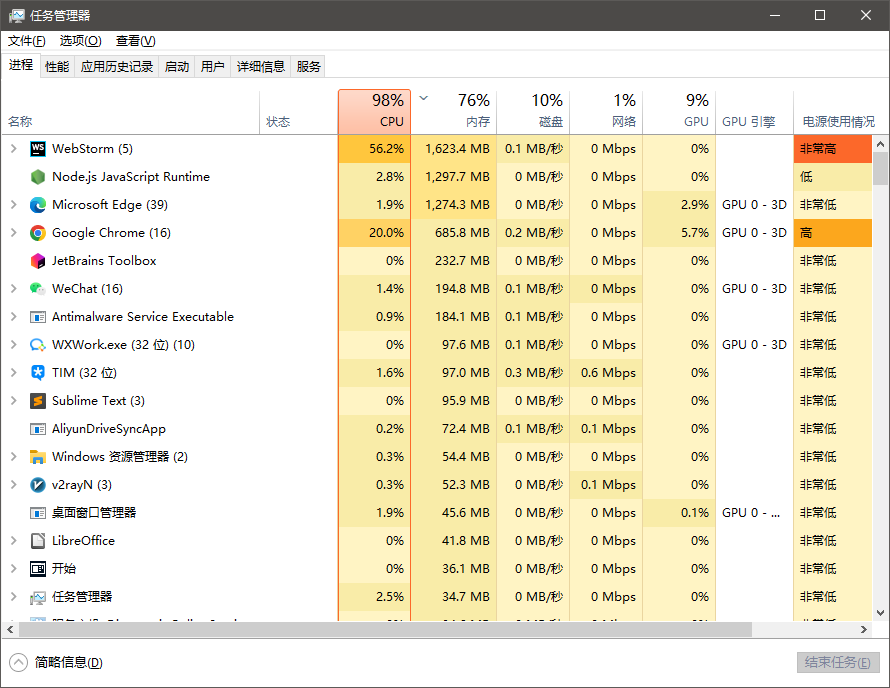
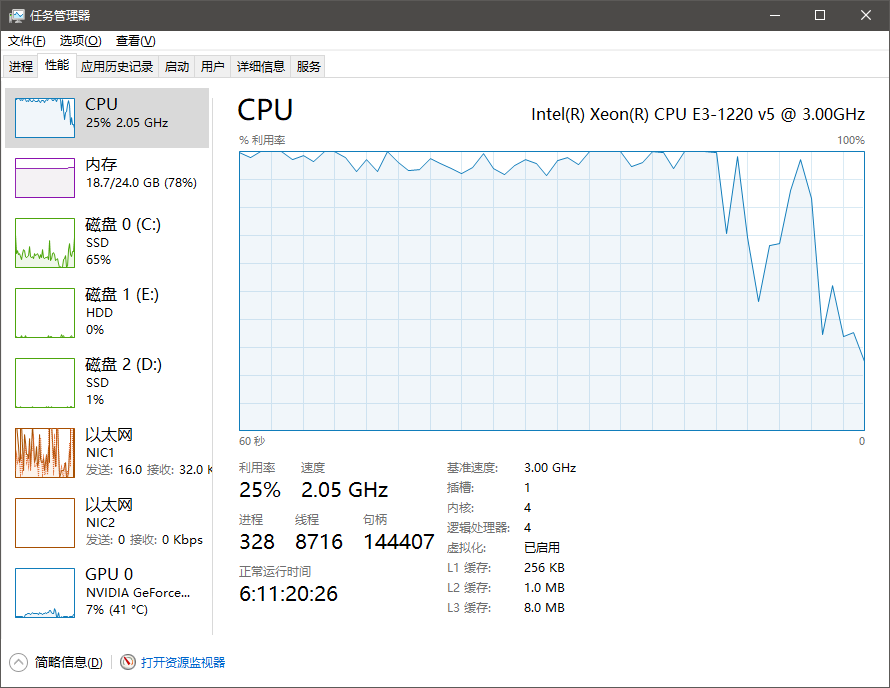
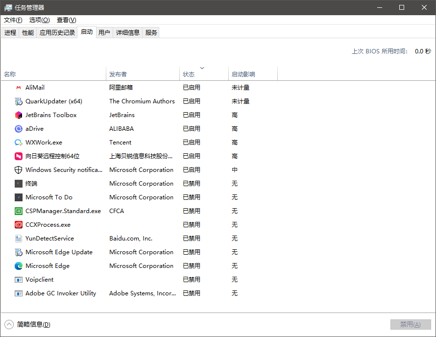

# taskmgr 任务管理器

'任务管理器的用户界面提供了进程、性能、应用历史记录、开机启动项列表、用户、详细信息与服务等菜单项。'

## 打开方式

- <kbd>Ctrl</kbd>+<kbd>Shift</kbd>+<kbd>Esc</kbd> 最快捷的打开方式
- 右键任务栏>任务管理器
- <kbd>Ctrl</kbd>+<kbd>Alt</kbd>+<kbd>Del</kbd> >任务管理器

## 资源监控

| 进程                         | 性能                         | 启动                         | 
|----------------------------|----------------------------|----------------------------|
|  |  |  |
| CPU ,内存,磁盘,网络 等            | 资源监控                       | 对启动项进行管理                   | 
| 可进行排序查看及结束进程操作             | 资源监控及查看                    | 对启动项进行管理,关闭不必要的启动项         | 

- CPU 过载: 数据处理太多,若导致无响应,则结束进程
- 内存 过大: 打开的软件太多,或某软件过大,考虑结束部分进程释放内存,或寻找资源占用更少的软件,若硬件需升级,则增加内存条
- 磁盘 响应慢: 涉及大量硬盘读写操作,导致反应过慢.若硬件需升级,则考虑更换固态.
- 网络 : 正在上传下载文件

